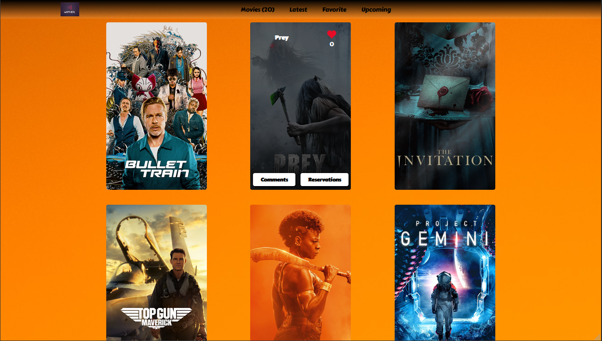

<a name="readme-top"></a>

<div align="center">

  
  <br/>

</div>

<!-- TABLE OF CONTENTS -->

# 📗 Table of Contents

- [📖 About the Project](#about-project)
  - [🎦 Video Description](#video) 
  - [🛠 Built With](#built-with)
    - [Tech Stack](#tech-stack)
    - [Key Features](#key-features)
  - [🚀 Live Demo](#live-demo)
- [💻 Getting Started](#getting-started)
  - [Setup](#setup)
  - [Prerequisites](#prerequisites)
  - [Install](#install)
  - [Usage](#usage)
  - [Run tests](#run-tests)
  - [Deployment](#triangular_flag_on_post-deployment)
- [👥 Authors](#authors)
- [🔭 Future Features](#future-features)
- [🤝 Contributing](#contributing)
- [⭐️ Show your support](#support)
- [🙏 Acknowledgements](#acknowledgements)
- [📝 License](#license)

<p align="center">
  
</p>

<div align="center"> 

  <span align="left" style="width: 250px">
     
  </span>

  <span align="right">
     
  </span>
</div>
<!-- PROJECT DESCRIPTION -->

# 📖 [MOVIEX] <a name="about-project"></a>
This is a movie application that lets users choose between different movies to watch based on the number of likes and comments. Built with ES6 and webpack. 

## Video description <a name="video"></a>

We built the application following the requirements from the github projects [`Kanban board`](https://github.com/Abdessittir/JavaScript-capstone/projects/1), which we enjoyed using.😍 You can find a video description of our project [here](https://drive.google.com/file/d/1UUzzP7FXdpw9hNdlCKP4KoaxuJm-YXyh/view?usp=sharing)👈😁

## PULL REQUESTS
[pull request](https://github.com/Abdessittir/JavaScript-capstone/pull/27)

## 🛠 Built With <a name="built-with"></a>

* HTML/CSS
* JavaScript (ES6/ES7..)
* webpack
* API

### Tech Stack <a name="tech-stack"></a>

<details>
  <summary>Client</summary>
  <ul>
    <li><a href="https://developer.mozilla.org/en-US/docs/Learn/HTML">HTML</a></li>
    <li><a href="https://developer.mozilla.org/en-US/docs/Learn/CSS">CSS</a></li>
    <li><a href="https://developer.mozilla.org/en-US/docs/Learn/JavaScript">JavaScript (ES6/ES7..)</a></li>
    <li><a href="https://webpack.js.org/">webpack</a></li>
  </ul>
</details>

<details>
  <summary>Server</summary>
  <ul>
    <li><a href="https://www.themoviedb.org/">themoviedb API</a></li>
  </ul>
</details>

<!-- Features -->

### Key Features <a name="key-features"></a>


- Display a list of movies from an external API
- Display a detail popup for each movie from an external API
- Add like and comment functionality to popup and movies items

<p align="right">(<a href="#readme-top">back to top</a>)</p>

<!-- LIVE DEMO -->

## 🚀 Live Demo <a name="live-demo"></a>


- [Live Demo Link](https://abdessittir.github.io/JavaScript-capstone/dist/)

<p align="right">(<a href="#readme-top">back to top</a>)</p>

<!-- GETTING STARTED -->

## 💻 Getting Started <a name="getting-started"></a>

To get a local copy up and running, follow these steps.

### Prerequisites

In order to run this project you need:
* GitHub flow
* Gitflow
* HTML and CSS
* JAVASCRIPT (ES6/...)
* Webpack
* npm
* Node.js
* Any code editer (vs code)


### Setup

Clone this repository to your desired folder:

```cd [your-folder] https://github.com/Abdessittir/JavaScript-capstone.git```

### Install

1. Run ```npm install```
 
2. Create a `.env` file in your root directory and add to it two environment variables `MOVIES_URL`, `MOVIE_DETAIL_URL`, `API_KEY`, and `IMAGE_URL`, for more info visit the [API docs](https://www.themoviedb.org/)

### Usage

To run the project, execute the following command:


1. for build ```npm run build```
2. for development ```npm start```

### Run tests

To run tests, run the following command:

```npm test```


### Deployment

You can deploy this project using:

```npm run deploy - Deploys using gh-pages```


<p align="right">(<a href="#readme-top">back to top</a>)</p>

<!-- AUTHORS -->

## 👥 Authors <a name="authors"></a>


👤 **Author1**

* GitHub: [@Abdessittir](https://github.com/Abdessittir)
* Twitter: [@AbdessittirHar1](https://twitter.com/AbdessittirHar1)
* LinkedIn: [Abdessittir Harkati](https://www.linkedin.com/in/abdessittir-harkati-a61b7324a/)

👤 **Author2**

* GitHub: [@yonas44](https://github.com/yonas44)
* LinkedIn: [Yonas Tesfu](linkedin.com/in/yonas-tesfu-3284811a9)

<p align="right">(<a href="#readme-top">back to top</a>)</p>

<!-- FUTURE FEATURES -->

## 🔭 Future Features <a name="future-features"></a>

- [ ] Add count for other navigation links
- [ ] Add TV shows page
- [ ] Add about page

<p align="right">(<a href="#readme-top">back to top</a>)</p>

## Contributing

Contributions, issues, and feature requests are welcome!
Feel free to check the [issues page](https://github.com/Abdessittir/JavaScript-capstone/issues).

## Show your support
Give a ⭐️ if you like this project!

## 📝 License

This project is [MIT](./MIT.md) licensed.

_NOTE: we recommend using the [MIT license](https://choosealicense.com/licenses/mit/) - you can set it up quickly by [using templates available on GitHub](https://docs.github.com/en/communities/setting-up-your-project-for-healthy-contributions/adding-a-license-to-a-repository). You can also use [any other license](https://choosealicense.com/licenses/) if you wish._

<p align="right">(<a href="#readme-top">back to top</a>)</p>
